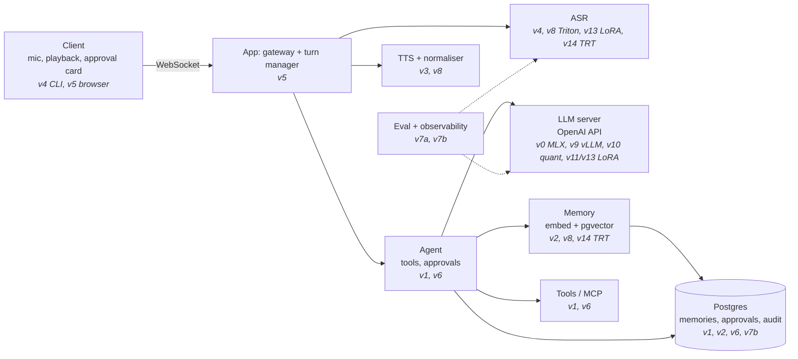

# Learning journal

This is an append-only log, newest entry first. Write one entry per session (it takes about 5 minutes).

## Mental map
Redraw this weekly in your own words. Each box is filled in by the versions listed under it.



## Still don't get (re-ask after 1 week and again after 4 weeks)
| Added | Question | Re-asked (1 week) | Re-asked (4 weeks) |
|---|---|---|---|

## Entry template
```markdown
### YYYY-MM-DD: <version> session N (learn | build | interview)
- **Built or watched:**
- **Predicted vs actual:**
- **Surprised me:**
- **I can now explain:**
- **Still don't get:**
- **Tomorrow's first step:**
```

---

_No entries yet. The first one comes from F, session 1._
