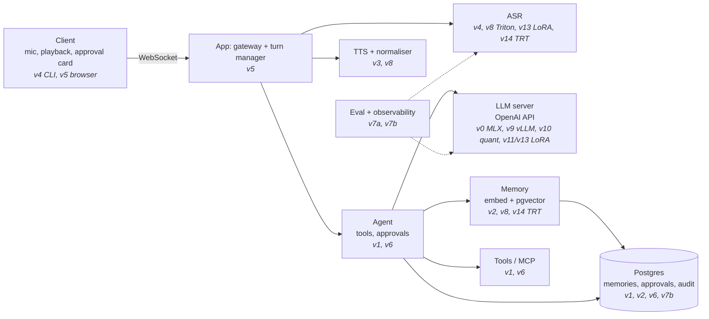

# Learning journal

This is an append-only log, newest entry first. Write one entry per session (it takes about 5 minutes).

## Mental map
Redraw this weekly in your own words. Each box is filled in by the versions listed under it.



## Still don't get (re-ask after 1 week and again after 4 weeks)
| Added | Question | Re-asked (1 week) | Re-asked (4 weeks) |
|---|---|---|---|
| 2026-10-08 | What is a model **contract** (app ↔ model-server API shape, so backends can be swapped), and how is it different from **structured output** (the model's text following a schema)? | due 2026-10-15 | due 2026-11-05 |
| 2026-10-09 | (F2 quiz, skipped; ask at the F checkpoint) What are query, key and value? Why does a low temperature make output predictable? Why does an LLM need attention instead of fixed word embeddings? | due F session 10 | — |

## Entry template
```markdown
### YYYY-MM-DD: <version> session N (learn | build | interview)
- **Built or watched:**
- **Predicted vs actual:**
- **Surprised me:**
- **I can now explain:**
- **Still don't get:**
- **Tomorrow's first step:**
```

---

### 2026-10-10: v0 build 2, part C: tracing with Langfuse
- **Built or watched:**
  - Replaced the hand-written OTel spans with the Langfuse SDK, kept behind reusable helpers in `tracing.py` (the only langfuse import).
  - One trace per turn, a session per chat run, an `llm.stream` generation with TTFT, exact usage and opt-in content.
  - `trace_id` on log lines.
- **Predicted vs actual:**
  - Early stop: I predicted ERROR. Actual: UNSET / `stopped_early`, because `GeneratorExit` isn't a failure.
  - Disabled-client warning: our first guess at the cause was wrong; we verified before fixing.
- **Surprised me:**
  - An infinite recursion: the log processor asked Langfuse for the trace id, and that lookup itself logs.
  - Tests passed alone but failed together, because the root logger leaked between tests.
  - Langfuse warns about missing keys even when tracing is off.
- **I can now explain:**
  - Logs, traces and metrics, and how each is shipped in production (agent / OTLP push / Prometheus scrape).
  - Auto vs manual instrumentation.
  - Vendor code at the seams.
  - The `content()` privacy gate.
  - `env_prefix` vs `validation_alias`.
  - Root dev deps vs app runtime deps.
  - `Generator` vs `Iterator` return types.
- **Still don't get:** —
- **Next:** v0 build 3, my sampler (learner-writes). The live Langfuse check is deferred until needed.

### 2026-10-10: v0 build 2, part A: contract tests with a fake network
- **Built or watched:**
  - `LLMClient(http_client=...)` (dependency injection).
  - `httpx2.MockTransport` fake server.
  - 4 contract tests: deltas joined, request body including `top_k`, mid-stream disconnect and stall, timeout before reply.
  - `conftest.py` isolates Settings from `.env` and `FRYDAY_*` vars.
- **Predicted vs actual:** I predicted a mid-stream disconnect would raise a **raw httpx error and crash** the CLI. ❌ In fact the SDK wraps it: `RemoteProtocolError` → `openai.APIConnectionError`, and `ReadTimeout` → `APITimeoutError`, with the original kept as `__cause__`. `cli.py`'s `except openai.APIError` was already right.
- **Surprised me:**
  - openai 3.x uses **httpx2**, not httpx. Check the library, don't assume.
  - The test answered in 0.25 s what we'd both guessed wrong.
- **I can now explain:**
  - Mocking the SDK vs faking the transport (the real SDK still runs) vs the real server.
  - Dependency injection.
  - TDD: write the test for the desired behaviour, run it, fix if red.
  - `pytest.raises` wrapping one statement.
  - `autouse` fixtures for test isolation.
  - Direct vs transitive dependencies.
- **Still don't get:** —
- **Next:** v0 build 2, part C: OpenTelemetry spans. Part B (the real-server `top_k` check) is pending.

### 2026-10-10: v0 walkthrough of build 1 (config, llm, logs, cli, tests)
- **Built or watched:**
  - Walked through every v0 file slowly.
  - Switched logging to structlog (my call).
  - Added config range checks (fail fast at startup).
  - Corrected the `max_retries` rationale.
- **Predicted vs actual:** I thought `llm.stream()` itself raises when the server is down. In fact a generator doesn't run until it's iterated, so the error appears in the `for` loop.
- **Surprised me:**
  - The `openai` SDK is just an HTTP client. `top_k` goes through `extra_body` to the *server's* sampler, never to the model.
  - "Prompt processing 59/60, 60/60" is prefill: the bulk of the prompt, then the last token on its own, which yields the first reply token.
  - We may not catch a mid-stream disconnect (it could be a raw httpx error). Build 2 will test it.
- **I can now explain:**
  - Config priority: code > env var > `.env` > default. `SecretStr`. Fail fast.
  - The seam and connection reuse.
  - Generators being lazy.
  - The structlog processor pipeline, `foreign_pre_chain` and contextvars (safe for concurrent turns in v5).
  - `perf_counter` (durations) vs `time.time` (timestamps).
  - `trim_history` edge cases.
  - `parametrize`, `monkeypatch`, `capsys`, test isolation.
- **Still don't get:** —
- **Next:** v0 build 2, contract tests with a fake OpenAI server, then OTel spans.

### 2026-10-10: v0 learn 1 + build 1: logits, decoding, first Fryday chat
- **Built or watched:**
  - `v0_logits.py`: real Qwen logits, shape (1, 38, 151936).
  - Temperature, top-k and top-p on real numbers.
  - Built `fryday-chat`: config, the `LLMClient` seam, JSON logs, history trimming, error handling.
- **Predicted vs actual:** —
- **Surprised me:**
  - At temperature 1.5, top-p 0.9 keeps **894** tokens (vs 4 at 0.3).
  - The first live chat hit a repetition loop (484 chunks), and I couldn't reproduce it in 18 runs.
  - The model mixes up "mera" (whose name?): it answered "Mera naam Fryday".
- **I can now explain:**
  - Logits vs probabilities (softmax only cares about differences).
  - Greedy, temperature, top-k, top-p, beam search, logprobs.
  - Why temperature 0 can still vary (near-ties plus floating point).
  - Low temperature for tool calls.
  - Why `max_retries=0` for streaming.
  - Why history keeps the system prompt first (prefix cache).
- **Still don't get:** —
- **Next:** v0 build 2, a contract test against a stub server plus OpenTelemetry spans.

### 2026-10-10: F session 7 (learn): what model hosting means
- **Built or watched:**
  - Hosting layers: weights, runtime, server, contract, app.
  - Weight formats.
  - Memory math (params × bytes).
  - Ran Qwen3-4B 4-bit with `mlx_lm.generate` and with `mlx_lm.server` plus `f7_probe.py`.
  - Also: a PyTorch primer (`f4_pytorch_primer.py`), plus walkthroughs of (B, T, C), nn.Linear and one attention head by hand.
- **Predicted vs actual:**

  | | Predicted | Actual |
  |---|---|---|
  | TTFT | 1–2 s | 0.53 s cold, 0.05–0.11 s warm |
  | Speed | 10 tok/s | about 42–55 tok/s |
  | RAM | about 4 GB | about 2.4–2.6 GB, which matches 4B × 0.5 bytes plus scales |

- **Surprised me:**
  - Speed was 4–5× faster than I guessed.
  - The prompt cache made a repeated prompt's TTFT about 10× smaller.
  - The model claimed it had set a reminder when it had no tool.
- **I can now explain:**
  - What each hosting layer does.
  - Why the contract lets the Mac (MLX) and the GPU (vLLM) swap.
  - Why 4-bit is about 2 GB.
  - Why warm-up exists.
- **Still don't get:** —
- **Next:** short F checkpoint, then v0 (LLM hosting I: build).

### 2026-10-10: F session 3 (learn): tokenisation
- **Built or watched:** Karpathy, *Let's build the GPT Tokenizer*. Toy: `spikes/learn/f3_tokens.py` on Qwen's real tokenizer.
- **Predicted vs actual:** I predicted English < Roman Hinglish < Devanagari ✅. The actual counts were 8 / 12 / 30 tokens.
- **Surprised me:**
  - Devanagari costs 3.75× English.
  - Byte-level BPE splits single Devanagari characters across tokens (the `�` pieces).
- **I can now explain:**
  - BPE sits between characters and words.
  - Byte-level BPE covers every language, at a cost for non-English scripts.
  - More tokens means more latency and more KV-cache memory.
- **Still don't get:** —
- **Tomorrow's first step:** F session 4, building a tiny GPT from scratch (part 1/2).

### 2026-10-09: F session 2 (learn): neural nets → transformers
- **Built or watched:** 3Blue1Brown neural nets, *Transformers* and *Attention*. Toy: `spikes/learn/f2_attention.py`, one attention head by hand.
- **Predicted vs actual:** skipped.
- **Surprised me:**
  - "bank" moves toward water or money purely from its neighbours.
  - The weights come out flat without the learned W_q and W_k.
- **I can now explain:**
  - Attention as three steps: score (q·k), normalise (softmax), blend (V).
  - Temperature sharpens or flattens the next-token distribution.
  - Past tokens' K and V never change, so they're cached (the KV cache).
- **Still don't get:** quiz deferred (see the table).
- **Tomorrow's first step:** F session 3, Karpathy's tokenizer lecture, plus a Hinglish token-count toy.

### 2026-10-08: F session 1 (learn): the big picture
- **Built or watched:** Karpathy, *Intro to Large Language Models*. Walked through one Fryday turn (architecture doc §1 and §4).
- **Predicted vs actual:** I predicted "model processing" eats most of the ~2 s. More precisely, ASR is the biggest cost on the Mac (1–2 s), and the LLM's time to its first chunk matters most on the GPU. Streaming hides the rest.
- **Surprised me:**
  - The app is a **hub**, not a pipeline: models never call each other.
  - The LLM can be called twice in one turn (once to decide on a tool, once to phrase the reply).
- **I can now explain:**
  - An LLM is two files, weights plus a run program, and the hosting layer (MLX, vLLM, Triton) is that run program.
  - The LLM only *proposes* tool calls. The app validates them and executes them.
  - Pretraining gives the model knowledge. Fine-tuning gives it behaviour and format.
  - Streaming overlaps LLM and TTS.
- **Still don't get:** contract vs structured output (I mixed them up in the quiz; see the table above).
- **Tomorrow's first step:** F session 2, the 3Blue1Brown neural-network refresher, then *Transformers* and *Attention*.
