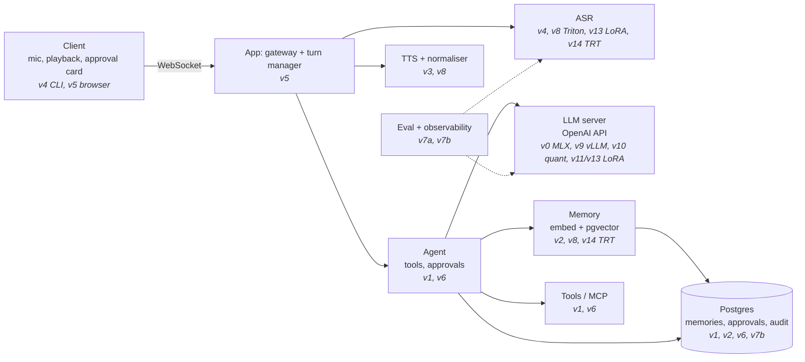

# Learning journal

This is an append-only log, newest entry first. Write one entry per session (it takes about 5 minutes).

## Mental map
Redraw this weekly in your own words. Each box is filled in by the versions listed under it.



## Still don't get (re-ask after 1 week and again after 4 weeks)
| Added | Question | Re-asked (1 week) | Re-asked (4 weeks) |
|---|---|---|---|
| 2026-10-08 | What is a model **contract** (app ↔ model-server API shape, so backends can be swapped), and how is it different from **structured output** (the model's text following a schema)? | due 2026-10-15 | due 2026-11-05 |
| 2026-10-09 | (F2 quiz, skipped; ask at the F checkpoint) What are query, key and value? Why does a low temperature make output predictable? Why does an LLM need attention instead of fixed word embeddings? | due F session 10 | — |

## Entry template
```markdown
### YYYY-MM-DD: <version> session N (learn | build | interview)
- **Built or watched:**
- **Predicted vs actual:**
- **Surprised me:**
- **I can now explain:**
- **Still don't get:**
- **Tomorrow's first step:**
```

---

### 2026-10-09: F session 2 (learn): neural nets → transformers
- **Built or watched:** 3Blue1Brown neural nets, *Transformers* and *Attention*. Toy: `spikes/learn/f2_attention.py`, one attention head by hand.
- **Predicted vs actual:** skipped.
- **Surprised me:**
  - "bank" moves toward water or money purely from its neighbours.
  - The weights come out flat without the learned W_q and W_k.
- **I can now explain:**
  - Attention as three steps: score (q·k), normalise (softmax), blend (V).
  - Temperature sharpens or flattens the next-token distribution.
  - Past tokens' K and V never change, so they're cached (the KV cache).
- **Still don't get:** quiz deferred (see the table).
- **Tomorrow's first step:** F session 3, Karpathy's tokenizer lecture, plus a Hinglish token-count toy.

### 2026-10-08: F session 1 (learn): the big picture
- **Built or watched:** Karpathy, *Intro to Large Language Models*. Walked through one Fryday turn (architecture doc §1 and §4).
- **Predicted vs actual:** I predicted "model processing" eats most of the ~2 s. More precisely, ASR is the biggest cost on the Mac (1–2 s), and the LLM's time to its first chunk matters most on the GPU. Streaming hides the rest.
- **Surprised me:**
  - The app is a **hub**, not a pipeline: models never call each other.
  - The LLM can be called twice in one turn (once to decide on a tool, once to phrase the reply).
- **I can now explain:**
  - An LLM is two files, weights plus a run program, and the hosting layer (MLX, vLLM, Triton) is that run program.
  - The LLM only *proposes* tool calls. The app validates them and executes them.
  - Pretraining gives the model knowledge. Fine-tuning gives it behaviour and format.
  - Streaming overlaps LLM and TTS.
- **Still don't get:** contract vs structured output (I mixed them up in the quiz; see the table above).
- **Tomorrow's first step:** F session 2, the 3Blue1Brown neural-network refresher, then *Transformers* and *Attention*.
