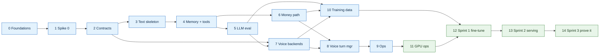

# Fryday — Implementation Roadmap

| | |
|---|---|
| **Implements** | [HLD v4](../specs/2026-10-04-fryday-hld-design.md) · [Architecture overview](../specs/2026-10-04-fryday-architecture.md) |
| **Date** | 2026-10-04 |
| **Pace** | 2–4 h a day; units sized at about 2–3 h |
| **Repo** | Public GitHub repo |

## How this plan works

There are two levels:
1. **Phases (this file).** Each phase has a goal, exit criteria, an estimate and dependencies. Each phase has its own file, `phase-NN-<name>.md`.
2. **Units, written at the start of each phase.** A unit is one piece of work of about 2–3 h. It names the files it touches and a failing test, then implements, verifies and commits, in the `superpowers:writing-plans` task format. Units are written into the phase's own file just before work on it begins, so they reflect what earlier phases taught us.

A phase is done when its **exit criteria** are met and its results are written down in `EXPERIMENTS.md`, `RUNBOOK.md` or the HLD. A phase is not done just because its time is up.

## Working principles

- **Every phase ends with a working system.** Phase 3 delivers a text conversation end to end, and every later phase extends something that runs.
- **Test first for logic:** the normaliser, the state machines, the protocol and the contracts. Measure, don't assert, for model quality and latency.
- **No GPU hours spent on debugging.** Everything is dry-run on the Mac first. GPU sessions follow a written checklist and get torn down afterwards.
- **Record every result, including negative ones,** in `EXPERIMENTS.md`.
- **When reality disagrees with the HLD, update the HLD.** Don't silently diverge.

## Stack defaults

| Area | Choice |
|---|---|
| Language and tooling | Python 3.12, `uv` workspace, ruff, pyright, pytest |
| App | FastAPI (WebSocket), LangGraph |
| Data | Postgres 16 + pgvector, Alembic |
| Client | React + Vite + TypeScript, kept thin |
| Models | Triton (KServe v2 gRPC), MLX-LM (Mac), vLLM (GPU) |
| ML | PEFT/LoRA, MLX LoRA, DVC, MLflow (local), `models.lock` |
| Ops | docker compose (profiles), GitHub Actions, OpenTelemetry → Langfuse Cloud, Prometheus |
| Repo layout | `app/` `client/` `models/` `ml/` `eval/` `infra/` `spikes/` `docs/` (architecture doc §7) |

## Phases

Estimates are working days at 2–4 h a day. Expect real time to be about 1.3–1.5× the estimate.

| # | Phase | Goal | Runs on | Days | Depends on |
|---|---|---|---|---|---|
| 0 | [Foundations](phase-00-foundations.md) | A clean public repo with CI, lint, tests and Postgres from day one | Mac | 2–3 | — |
| 1 | [Spike 0 (Mac)](phase-01-spike-0.md) | Answer the risky Mac-side questions before building on them | Mac | 4–6 | 0 |
| 2 | [Contracts + Mac backends](phase-02-contracts-mac-backends.md) | The app calls models through the two contracts, with tests | Mac | 5–6 | 1 |
| 3 | [Text agent skeleton](phase-03-text-agent-skeleton.md) | **First end-to-end slice:** typed Hinglish → local LLM → reply, traced | Mac | 6–7 | 2 |
| 4 | [Memory + non-spend tools](phase-04-memory-tools.md) | Fryday remembers you and acts through safe tools | Mac | 5–6 | 3 |
| 5 | [LLM eval harness + baselines](phase-05-llm-eval.md) | Measure the LLM before changing it | Mac | 6–8 | 4 |
| 6 | [Money path](phase-06-money-path.md) | Safe ordering against a mock grocery server with fault injection | Mac | 6–8 | 4 |
| 7 | [Voice backends + audio](phase-07-voice-backends.md) | Speech in and speech out models working on the Mac, with baselines | Mac | 7–9 | 2, 5 |
| 8 | [Voice turn manager](phase-08-voice-turn-manager.md) | Talk to Fryday end to end, with barge-in | Mac | 6–8 | 6, 7 |
| 9 | [Ops hardening](phase-09-ops-hardening.md) | SLOs, alerts, backups, retention, scans | Mac | 4–5 | 8 |
| 10 | [Training data + dry runs](phase-10-training-data.md) | Datasets ready and training scripts proven on the Mac | Mac | 6–8 | 5, 6, 7 |
| 11 | [GPU ops tooling](phase-11-gpu-ops.md) | Choose a provider; safe, scripted, cheap GPU sessions | Mac + ~2 h GPU | 3–5 | 9 |
| 12 | [GPU sprint 1: fine-tuning](phase-12-gpu-fine-tuning.md) | Fine-tune the LLM and ASR, quantise, gate | GPU + Mac | 5–7 | 10, 11 |
| 13 | [GPU sprint 2: serving + optimisation](phase-13-gpu-serving.md) | Everything on GPU Triton; TensorRT, profiling, CUDA principles | GPU | 6–8 | 12 |
| 14 | [GPU sprint 3: prove it](phase-14-prove-it.md) | Load, cost, chaos, demo and write-ups | GPU + Mac | 4–6 | 13 |

The estimates add up to about 80–107 working days. Phases 5 and 6 can run in either order. The order may change after spike 0; if it does, update this file.

Blue phases run on the Mac and green phases use a rented GPU.

## Setup items

| When | Item |
|---|---|
| Phase 1 | A Hugging Face account and token. IndicVoices, Kathbath and Shrutilipi need a free, auto-approved login. |
| Phase 1 | Download the ASR datasets and check their licences: IndicVoices Hindi, Kathbath, MUCS 2021 Hi-En (OpenSLR 104). Common Voice now needs a Mozilla Data Collective account. Skip CS-FLEURS, which is non-commercial and mostly synthetic. |
| Phase 1 | Langfuse Cloud signup. Choose the region now, because it can't be changed later. |
| Phase 4 | A web search API key, and a Google Cloud project with an OAuth consent screen (Calendar). |
| Phase 5 | API keys for the hosted baseline models, used offline only. |
| Phase 7 | Record the own-voice entity test set: 30–60 min of scripted Hinglish commands. |
| Phase 11 | A GPU provider account, chosen by the criteria in phase 11, plus a budget alert. |

## Coverage map

| HLD item | Phase |
|---|---|
| M0 spikes: Mac (S0-1, 2, 3, 5, 8, 9) / GPU (S0-6, 7, 11) / mock flag (S0-10) / deferred (S0-4) | 1 / 11 / 6 / — |
| M1 text agent, tools, approvals, memory, eval | 3, 4, 5, 6 |
| M2 voice on the Mac | 7, 8 |
| M3 LLM LoRA + quantisation | 10, 12 |
| M4 GPU serving + profiling | 13 |
| M5 ASR LoRA + TRT encoder + ASR gate | 12, 13 |
| M6 benchmarks, load, cost, demo | 14 |
| E1, E2 | 12 |
| E3 | 10 |
| E4, E6–E8 (E5 stretch) | 13 |
| E9–E11 | 14 |
| §8 SLOs and alerts | 9 (app), 11 (GPU heartbeat), 14 (GPU p95) |
| §8 timeouts | 3 |
| §8 backups | 9 |
| §8 runbook | 9, 11 |
| §8 versioning (WS `v`, Alembic) | 3 |
| §7 approval state machine, reconciler, audit, injection | 6 |
| §7 auth, scrubber | 3 |
| §7 OAuth | 4 |
| §7 retention, `forget`, audio opt-in | 9 |
| §7 supply chain: gitleaks | 0 |
| §7 supply chain: pip-audit, Trivy | 9 |
| §5 frozen sets, judge, gate matrix, `models.lock`, divergence | 5 (LLM), 7 (ASR) |
| §2 warm-up, readiness | 2 |
| §2 barge-in, admission, minute cap | 8 |
| Learning map: audio | 7 |
| Learning map: fine-tuning | 12 |
| Learning map: quantisation | 10, 12 |
| Learning map: LLM serving | 10, 14 |
| Learning map: ONNX | 2, 7 |
| Learning map: TensorRT | 13 |
| Learning map: CUDA | 13 |
| Learning map: Triton | 2, 7, 13 |
| Learning map: SWE | all |
