# Fryday — Architecture Overview

| | |
|---|---|
| **Status** | Draft v1, tracks the HLD |
| **Date** | 2026-10-04 |
| **Owner** | Harshit Goyal |
| **Source of truth** | [Fryday HLD](2026-10-04-fryday-hld-design.md) |
| **Last synced with HLD** | HLD v4 (2026-10-04) |

## How to read this document

The **HLD owns every decision and number**. This document explains them with pictures and plain language. Where the two disagree, the HLD wins and this document is wrong. Each section ends with the HLD section it comes from.

Anything that is not in the HLD yet is marked **`PROPOSED`**. Some marks cover a whole section and are noted at its top, as in §7, §8, §11.1, §12, §15, §16 and §17. A proposed item becomes a decision only when the HLD adopts it.

Unfamiliar terms are defined in the glossary in §3, which is worth skimming first.

**Reading paths**

- **New to the project:** §3 (skim) → §1 → §4 → §6 → §9.1 → §10 → §11 → §15 → §16
- **Five-minute walkthrough for a reviewer or interviewer:** §1 (what and why) → §4 (one turn, where each model runs) → §10 (same contracts, two backends) → §11 (one model's pipeline card) → §12 (experiments)
- **Before writing code:** §7, §8, §9, §14, §17

**Diagram index**

| # | Diagram | Type |
|---|---|---|
| D1 | One turn, coloured by where it runs | flowchart |
| D2 | System context | flowchart (C4 level 1) |
| D3 | Containers and interfaces | flowchart (C4 level 2) |
| D4 | Repository and code structure | flowchart |
| D5 | Data model | ER diagram |
| D6 | One turn, end to end | sequence |
| D7 | Barge-in | sequence |
| D8 | Real-money approval | state machine |
| D9 | Failure and degradation | flowchart |
| D10 | Model layer: Mac vs GPU | flowchart |
| D11 | ML lifecycle | flowchart |
| D12 | Deployment: Mac | flowchart |
| D13 | Deployment: GPU sprint | flowchart |
| D14 | Trust zones | flowchart |
| D15 | Development path | flowchart |

---

## 1. Fryday in one page

**What it is.** A personal voice assistant you talk to in Hinglish. You tap the mic button, speak, tap again when you are done, and it answers aloud. It remembers your preferences and acts through tools: Google Calendar, web search, notes and reminders, plus grocery ordering against a **mock** Swiggy-style server in v1. Anything that spends money needs a spoken confirmation **and** a tap.

> **You:** "Kal subah 7 baje ka reminder laga do, aur Instamart se doodh aur bread mangwa do."
> **Fryday:** "Reminder set ho gaya. Instamart pe doodh aur bread ₹112 ka hai, usual address pe. Order karun?"
> **You:** "Haan, order karo." *(and taps Confirm)*

**Why it exists.** Fryday is a learning vehicle for AI-engineering roles. Every model on the main path is open-weight and served by you. The topics it forces you to learn are fine-tuning, audio models, quantisation, ONNX, CUDA principles, TensorRT, Triton and production engineering, and each one produces a measured result.

**Goals**
- A working, production-grade voice assistant.
- Measured experiments for every optimisation, including the ones that showed no gain.
- Low cost: a Mac for daily work, and a rented GPU only for short sprints.
- Showcase: a recorded demo plus benchmark numbers, not a public URL.

**Not in v1** (HLD Phase 2)
- Vision.
- A phone app or wake word.
- Speaker verification.
- Routing to an outside model.
- An end-of-turn model.
- Proactive reminders.
- Smart-home tools.
- Custom CUDA kernels.

Always-on hosting is also out, because the runtime is on demand.

**Development path in five lines**
1. Spikes that prove the risky assumptions.
2. A text-only agent on the Mac.
3. Voice end to end on the Mac.
4. GPU sprints for fine-tuning, then TensorRT and Triton, then benchmarks.
5. Every result written to `EXPERIMENTS.md`.

*Source: HLD Context, Decisions, Phase 2.*

---

## 2. Quality goals and constraints

**Hard rule, never traded:** spend safety. Nothing costs money without a read-back of the stored order, a spoken confirmation and a UI tap, and an order is never placed twice.

**Quality goals.** The HLD's north star is learning depth over product polish. The ranking below is `PROPOSED`: a lower goal gives way when two conflict.

| Rank | Quality goal | What it means in practice |
|---|---|---|
| 1 | **Learning depth** | Each must-learn topic has a hands-on, measured deliverable (§12, §16). |
| 2 | **Responsiveness** | Time to first audio is about 1.4–1.8 s on the GPU (hypothesis; SLO p95 ≤ 2.0 s). Interrupting stops the reply immediately. |
| 3 | **Cost cap** | The GPU is off by default. Each sprint is scripted and the box tears itself down. There is a per-user daily minute cap. |
| 4 | **Privacy** | Audio is not stored by default. Traces are PII-scrubbed before export. The GPU box stores no user data or tokens, though it sees live audio and text in transit over the tunnel. Tools such as Google receive what they need to act. |

**Constraints**

| Constraint | Consequence |
|---|---|
| Apple M5, 16 GB, no NVIDIA GPU | CUDA, TensorRT and GPU Triton exist only on the rented box. The Mac runs CPU/Metal builds. |
| Minimal GPU budget | A 24 GB NVIDIA card (L4 class) from a provider chosen later, rented in short sprints. |
| One developer | One app deployable, Postgres as the only datastore, and a light observability stack. |
| Single user | Simple auth; admission control is still built and measured. |

*Source: HLD Decisions, §6, §7.*

---

## 3. Glossary of the words used below

| Term | Meaning |
|---|---|
| **ASR** | Automatic speech recognition: audio to text. |
| **TTS** | Text to speech. |
| **VAD** | Voice activity detection: is someone speaking right now? |
| **LLM** | Large language model. Here a 3–4B open model decides, answers and calls tools. |
| **KServe v2** | A standard inference protocol over gRPC/HTTP. Triton speaks it natively. |
| **OpenAI-compatible API** | The `/v1/chat/completions` shape. vLLM and MLX-LM both serve it. |
| **Triton** | NVIDIA's inference server. It hosts several models and backends on one machine. |
| **TensorRT / TRT-LLM** | NVIDIA's compiler that turns a model into an optimised GPU engine. |
| **ONNX** | A portable model format. It's the bridge from PyTorch to ONNX Runtime and TensorRT. |
| **CTranslate2 (CT2)** | A fast inference engine for Transformer models, used here for Whisper. |
| **LoRA** | Fine-tuning small adapter matrices instead of the whole model. |
| **AWQ / GPTQ / MLX 4-bit** | Different ways of storing weights in 4 bits. |
| **RTF** | Real-time factor: processing time divided by audio length. |
| **TTFT** | Time to first token. |
| **KV cache** | Stored attention keys and values that make generation fast. It's the main GPU-memory consumer for LLMs. |
| **Barge-in** | Interrupting the assistant while it speaks. |
| **Spike** | A small, throwaway experiment that answers one risky question. |
| **Tap-to-talk** | In v1, one tap on the mic button starts listening and a second tap ends your utterance. |
| **Contract** | A fixed API shape the app calls. Whatever backend implements it can be swapped. |
| **Epoch** | A counter on each turn. Audio from an older epoch is discarded. |
| **Idempotency key** | A unique key per action, so a repeated request cannot do the action twice. |
| **Compare-and-set** | Change a row only if it is still in the expected state, which prevents races. |
| **Admission control** | Capping concurrent conversations so latency holds for the ones admitted. |
| **C4** | A way of drawing architecture at levels: context, containers, components. |
| **ADR-lite** | A short record of a decision: context, choice, why, alternatives, consequence. |

---

## 4. The big picture: one turn, and where each model runs

**D1 — One turn, coloured by where each stage runs**

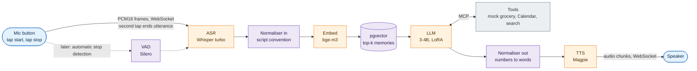

**What it shows.** One request, left to right.
- **Colours:** blue runs in the browser. Purple runs in the app service on the CPU, including the pgvector lookup in Postgres. Orange is a model reached through one of the two model contracts, which are fixed API shapes explained in §6. Grey is an outside service.
- **End of utterance:** in v1, you tap the mic to start and tap again to stop. Silero VAD, the dashed path, will later detect the end of speech automatically.
- **Normaliser:** it runs twice, on the way in to fix the script convention and on the way out to turn numbers into speakable words.

**Where the orange boxes run**

| Stage | On the Mac (daily development) | On the rented GPU (sprints) |
|---|---|---|
| ASR | Triton CPU (or ONNX Runtime if spike 0 fails), CT2/ONNX int8 | Triton Python backend running CT2 fp16/int8; TensorRT encoder experiment |
| Embeddings | Triton CPU, ONNX | Triton, TensorRT fp16 |
| LLM | MLX-LM **natively on macOS**; Docker has no Metal access | vLLM with AWQ/GPTQ 4-bit |
| TTS | Triton Python backend, PyTorch | Triton Python backend; ONNX/TensorRT is a stretch |

**Why it's shaped this way.**
- When VAD is used, it stays on the CPU next to the turn manager, so deciding "you stopped speaking" never waits on the network.
- Every model sits behind a contract, so the Mac and the GPU are interchangeable by changing config (§10).

*Source: HLD §1, §2, §3.*

---

## 5. System context

**D2 — Fryday and the outside world (C4 level 1)**

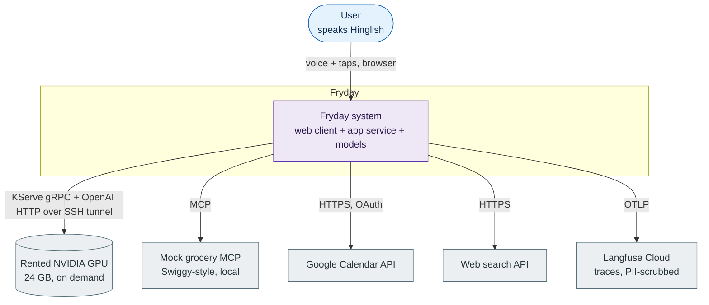

**What it shows.** Everything Fryday talks to.
- The rented GPU is drawn as an external system because it's temporary.
- When the GPU is off, the same models run on the Mac inside the Fryday box.
- Only scrubbed traces go to Langfuse Cloud, and no personal data goes to the GPU box.

*Source: HLD Decisions, §6.*

---

## 6. Containers and interfaces

**D3 — Containers (C4 level 2)**

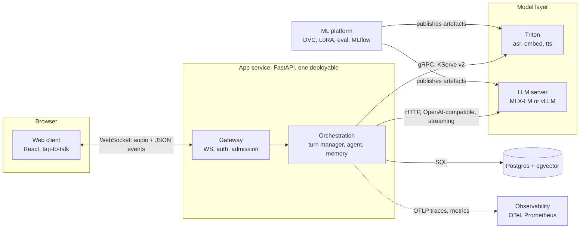

**What it shows.** Six deployable or offline parts.
- The app service is one deployable with clear internal modules (§7).
- The orchestration code knows only **two contracts** and never which backend is behind them.
- The ML platform runs offline and only produces model artefacts.

**The two model contracts** — `PROPOSED` detail

| Contract | Models | Calls the app relies on | Notes |
|---|---|---|---|
| KServe v2 gRPC | `asr`, `embed`, `tts` | `ServerReady`, `ModelReady`, `ModelInfer` (unary for asr/embed), streaming infer or chunked unary for `tts` | Inputs: `asr` takes FP32 audio at 16 kHz; `embed` takes text; `tts` takes normalised text plus a voice id. Every call can be cancelled. |
| OpenAI-compatible HTTP | LLM | `POST /v1/chat/completions` with `stream=true` and `tools=[…]`; `GET /v1/models` | Closing the stream aborts generation. Tool-call parsing depends on the model, and every call is validated with Pydantic. |

*Source: HLD §1, §3.*

---

## 7. Code and repository structure — `PROPOSED`

**D4 — Repository layout and app modules**

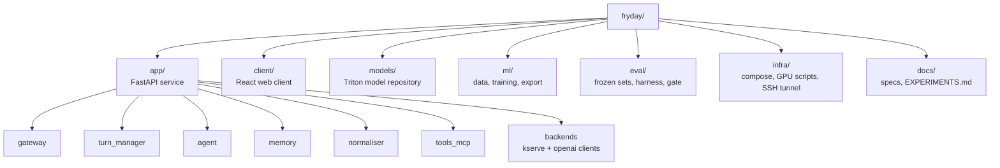

| Module | Responsibility | Depends on |
|---|---|---|
| `gateway` | WebSocket sessions, auth, admission control, framing (`turn_id`, `seq`) | turn_manager |
| `turn_manager` | Tap boundaries (VAD later), barge-in epochs, cancellation | backends |
| `agent` | LangGraph loop, tool selection, approval interrupt and state machine | backends, tools_mcp, memory, Postgres |
| `memory` | Retrieve top-k facts; extract new facts after a turn | backends (embed), Postgres |
| `normaliser` | Devanagari/Latin script convention; numbers, currency and dates into speakable words | — |
| `tools_mcp` | MCP clients, schema validation, idempotency keys | Postgres |
| `backends` | The only code that knows the two contracts. Mac or GPU is chosen by config. | — |
| *(cross-cutting)* PII scrubber | Strips phone numbers, addresses and names from traces before export | — |

**Why.** Each module has one job and one interface, so you can test it alone. The `backends` module is the seam that makes local-versus-GPU a config change. `models/` is a real Triton model repository, so the same folder (plus GPU-only variants) is mounted on both machines.

*Source: HLD §1; layout proposed.*

---

## 8. Data model — `PROPOSED`

**D5 — Core tables**

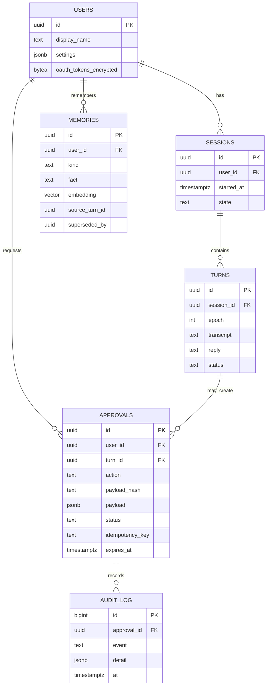

**What it shows.**
- Postgres is the only datastore in v1. It holds sessions too, so Redis isn't needed.
- `MEMORIES.embedding` uses pgvector.
- A fact that gets contradicted is never deleted. It's superseded, so its history stays.
- `APPROVALS` stores the exact payload and its hash, and `AUDIT_LOG` is written through an INSERT-only database role.

*Source: HLD §1 (item 4), §7; fields proposed.*

---

## 9. Runtime views

### 9.1 One turn, end to end

**D6 — Sequence of a turn with a tool call**

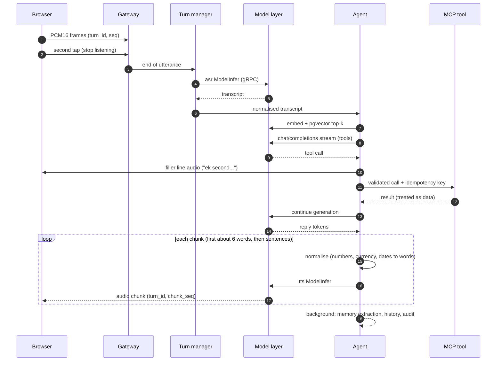

**Streaming details not drawn:**
- The browser has echo cancellation on.
- TTS chunks go through a bounded queue, so a slow client pauses TTS generation (backpressure).
- The client plays chunks in `chunk_seq` order through a jitter buffer.

**Latency budget** (copied from HLD §2, which is authoritative; hypotheses to measure)

| Stage | GPU (24 GB) | Mac |
|---|---|---|
| End of utterance | ~0 with second tap | same |
| ASR, 3–5 s utterance | 300–500 ms | 1–2 s |
| Memory lookup | 50 ms | 80 ms |
| LLM first token | 250 ms | ~600 ms |
| TTS first audio | 200–400 ms | spike |
| Tunnel round trip | 30–150 ms **per hop**, 4 hops (ASR, embed, LLM, TTS) | — |
| **First audio** | **~1.4–1.8 s** | **~3 s (dev only)** |

The LLM row also has to cover the ~6-word first chunk, not just the first token. Each model runs a warm-up call before its readiness probe goes green.

**Which optimisation attacks which stage.**
- ASR: CT2 int8, the TensorRT encoder, and a streaming-native ASR candidate.
- LLM first token: 4-bit quantisation, the vLLM KV cache, and CUDA graphs.
- TTS: a short first chunk, plus ONNX/TensorRT as a stretch.
- Overall: GPU region close to you.

### 9.2 Barge-in

**D7 — Interrupting the assistant**

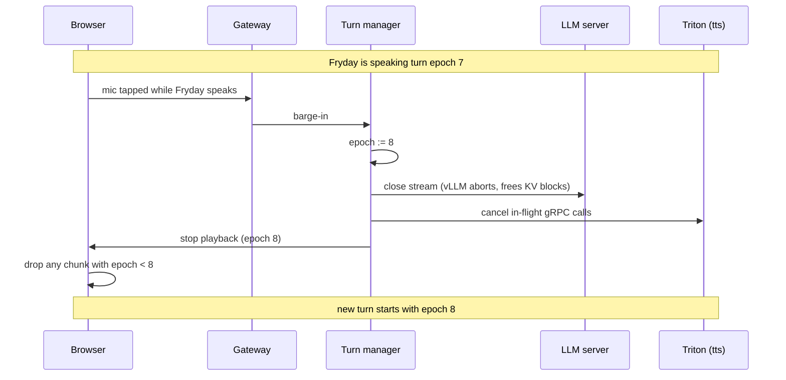

**Why.** Every audio chunk carries its turn epoch, so a late chunk from the old reply can never play over the new one. Cancellation reaches the models too, so the GPU stops doing work nobody will hear. Tap-to-talk avoids running VAD on the assistant's own echo in v1. The same tap that interrupts also starts listening for your next sentence.

### 9.3 Real-money approval

**D8 — Approval state machine**

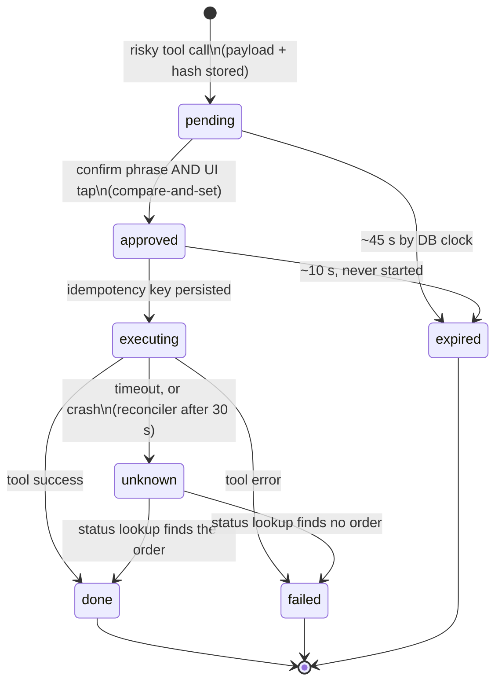

**The rules behind the picture**
- **Read-back:** the assistant reads back text built from the **stored row**, never from fresh LLM output, so injected text can't change what you approve.
- **Compare-and-set:** approve and expire both use `UPDATE … WHERE status = 'pending' AND expires_at > now()`, so two confirmations can't both win and an expired approval can't be confirmed.
- **Phrase and tap are bound:** both must carry the same `approval_id` and `payload_hash`.
- **At-most-once with reconciliation:** a reconciler runs at startup and every 60 s. It moves any `executing` row older than 30 s to `unknown`, then resolves it by order-status lookup. The mock can either honour or ignore idempotency keys, so both cases are tested; the invariant is orders per approval ≤ 1.
- **Amount as text:** the approval card always shows the amount, items and address as text.
- **No resends:** a spend action is **never re-sent**. A timeout becomes `unknown`, and Fryday asks the grocery server for the order status.
- **What "done" means:** the v1 mock copies Swiggy's flow. An order passes through `PENDING_PAYMENT`; `done` means `confirm_order` returned `PLACED`, and `FAILED` maps to `failed`.
- **Fault modes in the mock:**
  - response dropped after commit;
  - timeout before commit;
  - idempotency key ignored;
  - stuck payment;
  - eventually-consistent status;
  - 5xx;
  - schema drift;
  - crash between persisting the key and making the call.
  
  Every one must keep orders per approval ≤ 1.
- **A real Swiggy adapter** (Builders Club) is deferred, and must pass the same contract tests.
- **Non-spend tools** get one retry with the same idempotency key. `PROPOSED`: approval for non-spend risky actions (sending, deleting) is voice-only.

### 9.4 Failure and degradation

**D9 — What happens when things break**

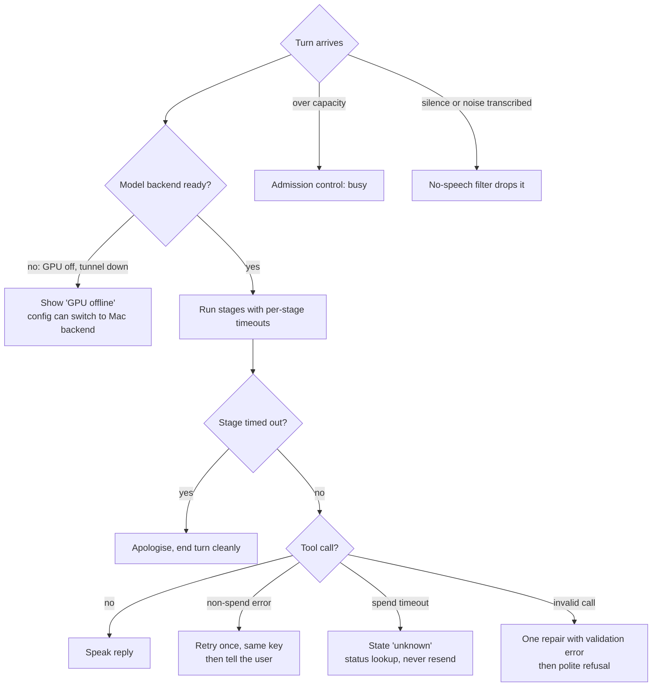

**Not drawn:**
- **WebSocket drop:** the in-flight turn is restarted with history kept, and pending approvals expire.
- **Duplicate connection:** the newest wins.
- **Postgres down:** the service reports unhealthy and refuses turns.
- **OAuth or MCP failure:** that tool is disabled with a clear message.

*Source: HLD §2, §7, §9.*

---

## 10. Model layer: same contracts, two backends

**D10 — One app, two interchangeable model backends**

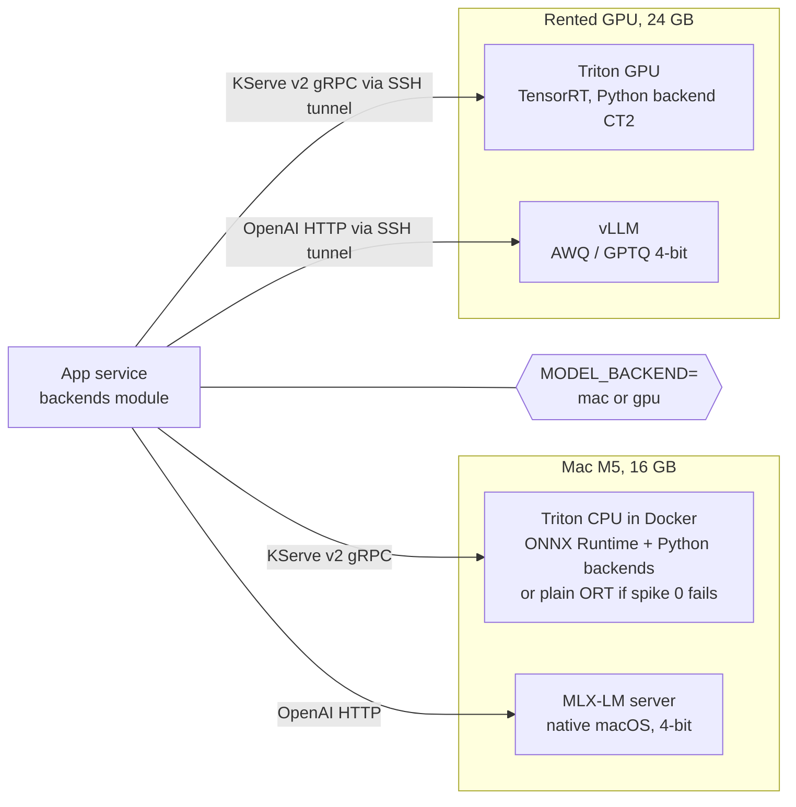

**What it shows.** The app makes the same contract calls on both machines. One setting chooses the target.

**What is not identical.** The 4-bit formats differ (MLX against AWQ/GPTQ), and so do the ASR and TTS builds. That's why the release gate scores each (model, backend, format) row separately and tracks a **Mac-versus-GPU divergence** metric (§11.3).

**GPU memory layout on a 24 GB card** (copied from HLD §3; an estimate pending the spike; the overhead figure is `PROPOSED`)

| Allocation | ~GB |
|---|---|
| LLM weights, 4-bit | 3 |
| LLM KV cache (capped) | 6 |
| ASR (Whisper turbo) | 2 |
| TTS | 2–3 |
| Embeddings (bge-m3, fp16) | 1.1 |
| CUDA contexts and Triton overhead | 1–3 |
| **Total** | **≈16–18 of 24** |

vLLM reserves most of the GPU by default, so its memory fraction must be capped or the other models fail to load.

*Source: HLD §3, §5, §6.*

---

## 11. Models and the ML lifecycle

### 11.1 Model pipeline cards

**`PROPOSED`.** The HLD names the candidate families; the cards add exact IDs, datasets and methods. Candidates are chosen by a baseline test.
- **(verified)** means the HLD fact-check on 2026-10-04 confirmed it against the model card.
- **(verify)** means the exact ID, licence or capability still needs checking in spike S0-5.
- An ID with no mark is a well-known release, still to be re-checked in S0-5.

**ASR — speech to text**

| Item | Choice |
|---|---|
| Candidates | All ungated. `openai/whisper-large-v3-turbo` (verified: MIT); `Oriserve/Whisper-Hindi2Hinglish-Apex` (verified: Apache-2.0, outputs **Roman-script** Hinglish), with `…-Prime` as the alternative; streaming-native: `nvidia/nemotron-3.5-asr-streaming-0.6b` (verified: OpenMDW, Hindi included) |
| Problem to fix | Names of products, brands, places and people inside mixed Hindi-English speech |
| Training data | Public sets: IndicVoices Hindi, Kathbath train, MUCS 2021 Hi-En train (FLEURS and Common Voice if needed); synthetic name-dense speech made with an open TTS. CS-FLEURS is not used (non-commercial, mostly synthetic). |
| Method | LoRA on GPU sprint 1, merge, quantise |
| Serve | Mac: CT2/ONNX int8. GPU: CT2 fp16/int8 in the Triton Python backend; TensorRT-LLM encoder as an experiment |
| Evaluate | WER on public speaker-disjoint test splits (MUCS 2021 test, Kathbath test-unknown); entity accuracy on a 30–60 min **own-voice entity set** (test only); plus a synthetic-only dev set to catch TTS-quirk overfitting |
| You learn | Audio features (log-mel), encoder-decoder ASR, LoRA on speech, why Whisper isn't streaming, and TensorRT on a hard model |

**LLM — decide, answer, call tools**

| Item | Choice |
|---|---|
| Candidates | `Qwen/Qwen3-4B-Instruct-2507` (verified: Apache-2.0, ungated, tool calling) as the default. Any newer **ungated** 2026 3–4B model with tool calling may join the baseline. |
| Problem to fix | Reliable tool calls with valid arguments; natural Hinglish at spoken length |
| Training data | About 5–10k synthetic Hinglish tool conversations, made by an open-weight generator and checked against mock tools; a small share of public function-calling data (Glaive, xLAM); hand-written seeds |
| Method | LoRA SFT (PEFT on GPU sprint 1; small MLX LoRA runs on the Mac), merge, 4-bit quantise |
| Serve | Mac: MLX 4-bit through `mlx_lm.server`; streaming plus tool calling is unverified (spike S0-3). GPU: vLLM with AWQ or GPTQ |
| Evaluate | Tool-choice accuracy, argument validity, judge-scored Hinglish quality (judge differs from the generator and is calibrated on human labels), on 200 frozen hand-reviewed conversations |
| You learn | SFT and LoRA, chat templates, constrained decoding, quantisation trade-offs, KV cache, continuous batching |

**TTS — text to speech**

| Item | Choice |
|---|---|
| Candidates | `nvidia/magpie_tts_multilingual_357m` (verified: ungated, Hindi, NVIDIA Open Model License; batched synthesis, not native streaming, so Fryday streams by sending chunks); fallback `facebook/mms-tts-hin` (licence: verify) |
| Problem to fix | Natural, fast speech for mixed-script text |
| Method | No fine-tuning in v1. Pick on naturalness and speed, and fix one voice. |
| Serve | PyTorch/NeMo in the Triton Python backend; ONNX/TensorRT is a stretch |
| Evaluate | RTF threshold plus a small listening panel |
| You learn | Acoustic model and vocoder, why chunking affects prosody |

**Embeddings — memory search**

| Item | Choice |
|---|---|
| Candidates | `BAAI/bge-m3` (verified: MIT, multilingual); fallback `intfloat/multilingual-e5-small` on the Mac (verify) |
| Method | No training. It's the **easy TensorRT target**. |
| Serve | Mac: ONNX. GPU: TensorRT fp16. |
| Evaluate | Output parity (cosine) between PyTorch, ONNX and TensorRT, plus latency |
| You learn | ONNX export, parity testing, building a TensorRT engine with dynamic shapes |

**Text normaliser** (rules, not a model)

| Item | Choice |
|---|---|
| Out, before TTS | Our own rule set turning numbers into Hindi words. It uses a 0–99 word table, the Indian grouping (सौ, हज़ार, लाख, करोड़) and patterns for money, time, date, units and abbreviations. Example: ₹112 → एक सौ बारह रुपये. NeMo supports Hindi only for words → numbers, so it's adopted only if spike 0 shows its numbers → words works. |
| In, after ASR | The script convention is decided in spike S0-8. Option A keeps Roman Hinglish inside and converts to Devanagari only before TTS. Option B fine-tunes the ASR to output Devanagari for Hindi words. Transliteration (IndicXlit, verify) is the fallback. |
| Evaluate | Golden unit tests for every rupee, number, time and date format |
| Safety | Amounts are always shown as text on the approval card, so a TTS mistake never decides a purchase |

**VAD — later, not v1**

| Item | Choice |
|---|---|
| Model | Silero VAD (MIT, under 1 ms per chunk on the CPU) |
| Runs | App service CPU, never the model server. v1 uses tap-to-stop instead. |

### 11.2 ML lifecycle

**D11 — From data to a served model**

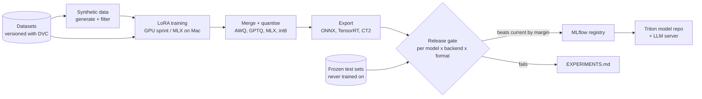

**What it shows.** Data flows one way, from versioned datasets to the served artefact. The gate scores the **exact artefact that will be served**: the quantised, exported build for that backend, not the full-precision model.

### 11.3 Release gate and test sets

- **Frozen sets:**
  - ASR: public speaker-disjoint test splits, plus the own-voice entity set (test only).
  - LLM: 200 hand-reviewed tool conversations.
  - Every use of a frozen set is counted, and frozen sets are never used for tuning.
- **Hygiene:** dedup and template-overlap checks between train and test.
- **Gate matrix:** one row per (model, backend, format), each with its own thresholds and confidence intervals. The promotion margin must exceed the noise.
- **Mac-versus-GPU divergence:** tool-call agreement on the same frozen set.
- **Baselines:** hosted ASR and LLM, run offline on the frozen sets, as the reference point.

*Source: HLD §3, §4, §5.*

---

## 12. Experiments

The HLD names these experiments; the hypotheses, variables and E-numbers are `PROPOSED`. Each row becomes a section of `EXPERIMENTS.md`, including the ones that show no gain.

| # | Hypothesis | Variable | Metrics | Runs on |
|---|---|---|---|---|
| E1 | Constrained decoding alone gives most of the tool-call validity | none / constrained / fine-tune / both | Argument validity, tool accuracy | GPU (vLLM). The Mac has no server-side structured output, so only validate-and-repair runs there. |
| E2 | 4-bit costs little quality for a large speed gain | fp16 vs AWQ vs GPTQ vs MLX 4-bit | Tool accuracy, judge score, TTFT, tokens per second | GPU + Mac |
| E3 | A from-scratch quantiser shows where the error comes from | int8 / int4, per-tensor vs per-group | Reconstruction error per layer | Mac |
| E4 | TensorRT beats ONNX beats PyTorch on embeddings | runtime and precision | Latency, throughput, cosine parity | GPU |
| E5 | A TensorRT Whisper encoder beats CT2 | ASR runtime | Latency, WER | GPU |
| E6 | CUDA graphs cut launch overhead | on / off | TTFT, Nsight timeline | GPU |
| E7 | One Triton instance beats separate servers | layout | Latency p50/p95, GPU memory | GPU |
| E8 | Triton's vLLM backend costs little against standalone vLLM | serving path | TTFT, throughput | GPU |
| E9 | KV-cache formula matches vLLM reality; continuous batching scales | concurrency 1→N | TTFT and throughput against concurrency | GPU |
| E10 | There is a max concurrency before the latency target breaks | load (k6/Locust over WebSocket) | First-audio p95 | GPU |
| E11 | Cost per conversation-minute is known | configuration | $/minute | GPU |

*Source: HLD §4.*

---

## 13. Deployment views

**D12 — Mac, daily development**

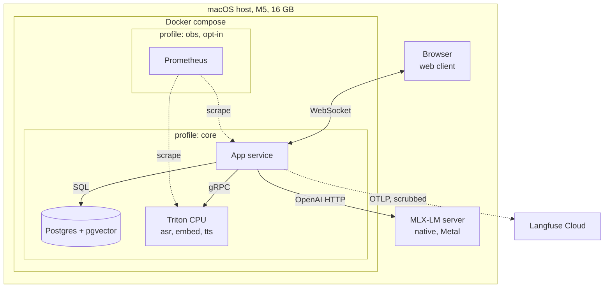

**Why.**
- MLX runs outside Docker because containers on macOS can't use the Apple GPU.
- Langfuse is the cloud tier, because self-hosting it needs ClickHouse, Postgres, Redis and S3. That stack is too heavy to run beside the models on a 16 GB Mac.
- Grafana runs only on GPU days.
- Spike S0-2 measures the real memory use.

**D13 — GPU sprint**

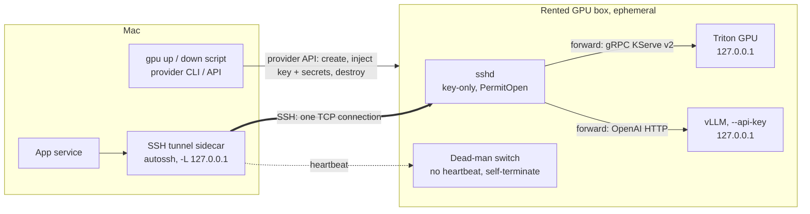

**Why.**
- The Mac reaches the box only through an SSH tunnel, using a per-session ed25519 key. The tunnel runs as a compose sidecar, because containers can't reach the host's loopback.
- The box does inference only. It stores no user data and no OAuth tokens, though it sees live audio and text in transit.
- A per-user daily minute cap limits usage.
- The only public port is the key-only sshd. `PermitOpen` allows just the Triton and vLLM ports, and both services bind to 127.0.0.1.
- SSH and gRPC keepalives keep long streams alive. One TCP connection carries everything, so p95 latency is measured, not just RTT.
- Provider criteria: direct VM SSH with `-L`, Docker + NVIDIA toolkit, `SYS_ADMIN` for Nsight, and persistent model cache.
- Cost guards: a teardown timer, a dead-man switch, a provider budget alert and a sprint checklist.

*Source: HLD §6.*

---

## 14. Cross-cutting concepts

### 14.1 Security and trust zones

**D14 — Trust zones**

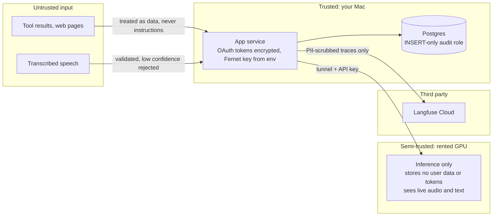

- **Auth:** single user with one static access token. The app listens only on localhost and checks Origin on the WebSocket. The token goes in the first message, never in the URL. Google scope: `calendar.events.owned`.
- **Supply chain:** images pinned by digest, a lockfile, `pip-audit`, Trivy and gitleaks, and models pinned by revision and hash in `models.lock`.
- **Prompt injection:** tool output is wrapped as data, approval text comes from structured fields, and an injection test suite runs in CI.
- **Privacy:** audio is off by default, opt-in and deletable. Transcripts are kept 30 days, a `forget` command deletes everything about the user, and the PII scrubber also covers local logs.
- **Known v1 risk:** there's no speaker verification. The UI tap mitigates it.

### 14.2 Observability

- **Traces:** every turn is one OpenTelemetry trace with spans for each stage (end of utterance, ASR, memory, LLM, tool, TTS). It goes to Langfuse Cloud after the PII scrubber.
- **Metrics:** Prometheus collects app and Triton metrics. Grafana and DCGM run on GPU days only.
- **Profiling:** Nsight Systems during GPU sprint 2. GPU counters may need extra container privileges, which is checked before the sprint.

### 14.3 Testing and CI

| Where | What runs | Real models? |
|---|---|---|
| GitHub Actions CI | Unit tests (normaliser, chunker, approval state machine, memory); contract tests against a **stub** KServe/OpenAI server; MCP tests with recorded responses; injection suite | No |
| Local `make e2e` | Recorded Hinglish audio replayed end to end; behavioural contract tests (tool-call schema, chat-template parity) | Yes, Mac |
| GPU sprint script | The same e2e and contract suite against the GPU; load test | Yes, GPU |
| Manual | Live Google Calendar smoke test (no live grocery orders in v1) | Live |

### 14.4 Config and secrets

- **One setting** switches the model backend: `MODEL_BACKEND=mac|gpu`.
- **Local secrets** are environment files, never committed.
- **The GPU box** receives only inference secrets (the vLLM API key and the per-session SSH public key) at boot, and its disk is wiped on teardown.

### 14.5 Operations

| Concern | v1 approach |
|---|---|
| SLOs | p95 first audio ≤ 2.0 s on the GPU (≤ 4 s on the Mac); turn success ≥ 98%; zero unresolved spend `unknown` after 5 min |
| Alerts | A small script checks Prometheus and raises a desktop notification on an SLO breach, a stuck `unknown` or a missed GPU heartbeat |
| Timeouts | ASR 3 s, LLM first token 2 s, TTS chunk 2 s, MCP non-spend 5 s, MCP spend 15 s and then `unknown` (initial values) |
| Backups | Nightly encrypted `pg_dump`, 7 kept, quarterly restore drill. The Fernet key is stored apart from the dumps. |
| Runbook | `RUNBOOK.md` covers: GPU box dead or tunnel down, stuck `unknown`, expired OAuth, Postgres restore, model rollback |
| Versioning | The WebSocket protocol has a `v` field; models are versioned in the Triton repository; Alembic migrations run on startup |

*Source: HLD §1 (item 6), §6, §7, §8, §10.*

---

## 15. Technical choices (ADR-lite)

The decisions come from the HLD. The **Why**, **Rejected** and **Consequence** columns are explanation and are `PROPOSED` wherever the HLD doesn't state them.

### Local development

| # | Decision | Why | Rejected | Consequence |
|---|---|---|---|---|
| L1 | Develop on the Mac and rent the GPU only for sprints | Minimal cost; most of the work needs no GPU | Always-on GPU; local NVIDIA box | All CUDA, TensorRT and GPU Triton work is batched into sprints |
| L2 | Triton on the Mac too (CPU), if spike 0 passes | Learn Triton every day for free | Mac-only plain services (never learn Triton); Triton for the LLM on the Mac (too slow) | Arm64 Triton is a risk; plain ONNX Runtime behind the same contract is the fallback |
| L3 | MLX-LM natively for the LLM on the Mac | Docker has no Metal access; MLX is fast on Apple silicon | llama.cpp (fine too); CPU Triton (too slow) | Different 4-bit format from the GPU, so per-backend gate |
| L4 | Postgres only (no Redis or MinIO); filesystem for artefacts | Fits 16 GB, single user | Redis sessions; MinIO | Add them when load or multi-user demands it |
| L5 | Langfuse Cloud with PII scrubbing | Self-hosting needs ClickHouse and more, and won't fit | Self-host; Phoenix/Jaeger | A third party sees scrubbed traces |

### Serving and optimisation

| # | Decision | Why | Rejected | Consequence |
|---|---|---|---|---|
| S1 | Two contracts: KServe v2 and OpenAI-compatible | Industry standards; backend swap by config | A custom API per model | Contract tests guard both backends |
| S2 | Triton for ASR, TTS and embeddings | Several model types on one GPU; batching, metrics, ensembles | One FastAPI service per model | Learn the model repository and config.pbtxt |
| S3 | CT2 Whisper through the Triton Python backend | No official CT2 backend exists | — | TensorRT-LLM encoder is an experiment, not the default |
| S4 | vLLM for the LLM on the GPU | Paged attention, continuous batching, AWQ/GPTQ | TensorRT-LLM as the default (kept as a stretch) | Triton's vLLM backend is compared in E8 |
| S5 | TensorRT learned on embeddings first | An easy model teaches the tools before the hard one | Starting with Whisper | E4 then E5 |

### Models and fine-tuning

| # | Decision | Why | Rejected | Consequence |
|---|---|---|---|---|
| F1 | Fine-tune the LLM before the ASR | Cheaper, faster feedback | ASR first | Sprint 1 does the LLM first |
| F2 | LoRA (PEFT) rather than full fine-tuning | Fits a 24 GB card; standard practice | Full fine-tuning | Merge before quantising |
| F3 | Synthetic data checked against mock tools | Cheap and targeted at the real tools | Hand-writing everything | Filter, dedup, frozen real-speech test set |
| F4 | No TTS fine-tuning in v1 | Low learning value per hour | A custom voice | Optional later |
| F5 | Constrained decoding as an experiment | It may explain validity without fine-tuning | Assuming fine-tuning is needed | E1 |

### App, data and ops

| # | Decision | Why | Rejected | Consequence |
|---|---|---|---|---|
| A1 | FastAPI as one deployable | One person; fewer moving parts | Separate gateway and orchestration services | Split later if load requires |
| A2 | LangGraph agent with an approval interrupt | Pause and resume on approval is built in | A hand-rolled loop | Approval state also stored in Postgres |
| A3 | Voice plus tap for spend actions | Speech alone can be misheard or spoofed | Voice only | Needs the web UI for purchases |
| A4 | GPU provider chosen later; SSH tunnel for the link | Every provider offers SSH, there's no extra account, and no public ports beyond sshd | Tailscale (needs an extra account and TUN support); public ports | The provider must support direct SSH `-L` forwarding (Vast.ai and Lambda are documented; RunPod's proxy SSH isn't) |
| A6 | Mock grocery MCP server in v1 | Safe, free and repeatable; fault injection exercises the money path harder than live Swiggy safely allows | Real Swiggy now | A real adapter later must pass the same contract tests |
| A7 | Ungated open models by default | No access requests; works out of the box | Llama, Gemma, Indic Parler (gated) | Smaller comparison set |
| A5 | MLflow local file store; DVC for data; `models.lock` pins what is served | Light, no server; exact provenance | Hosted registry | Rollback = repoint `models.lock` |

*Source: HLD Decisions, §1, §3, §6, §7.*

---

## 16. Development path

**D15 — Milestones and GPU sprints**

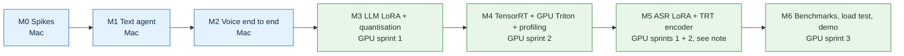

Blue milestones run on the Mac and green ones need the rented GPU.

**ASR timing (HLD v3):** the ASR LoRA is trained in sprint 1, after the LLM. The TensorRT encoder work (E5) runs in sprint 2, and M5 is evaluated once both are done.

The exit criteria and the "You learn" column below are `PROPOSED`.

| Milestone | Goal | Runs on | You learn | Exit criteria |
|---|---|---|---|---|
| **M0 Spikes** | Prove the risky assumptions | Mac | Triton basics, MLX, memory budgeting | Each spike in §17 has a recorded pass or fail and the fallback chosen |
| **M1 Text agent** | Typed Hinglish in, real tools out, approvals, memory | Mac | LangGraph, MCP, state machines, eval harness | LLM baseline scored on the frozen set; approval state machine and reconciler pass every mock fault mode (orders per approval ≤ 1); live Calendar smoke test passes |
| **M2 Voice** | Speak in, hear out, with barge-in | Mac | Audio basics, WebSocket streaming, ONNX export, Triton CPU | `make e2e` passes on recorded audio; first-audio latency measured on the Mac; barge-in drops stale chunks |
| **M3 LLM fine-tune** | Better tool calls and Hinglish | GPU sprint 1 + Mac | LoRA SFT, synthetic data, quantisation | Gate passed for at least one (backend, format) row; E1–E3 written up |
| **M4 GPU serving** | Everything on GPU Triton, optimised | GPU sprint 2 | ONNX→TensorRT, Triton config, Nsight, CUDA principles | E4, E6, E7 and E8 written up; GPU contract and e2e suite pass |
| **M5 ASR fine-tune** | Better names in mixed speech | GPU | Speech LoRA, TensorRT-LLM Whisper | Entity accuracy improved on the real-voice set, past the margin; E5 written up |
| **M6 Prove it** | Numbers and a demo | GPU sprint 3 | Load testing, capacity, cost | E9–E11 written up; admission limit set from data; demo recorded |

*Source: HLD §4, §11.*

---

## 17. Risks and open spikes

The HLD lists these unknowns. The pass criteria, fallbacks and "Blocks" column are `PROPOSED`.

| Spike | Question | Pass criterion | Fallback | Blocks |
|---|---|---|---|---|
| S0-1 | Does Triton's arm64 CPU container run on the M5 under Docker? | Serves an ONNX model through KServe v2 gRPC | Plain ONNX Runtime/CT2 behind the same contract | M2 |
| S0-2 | Does the `core` profile fit in 16 GB alongside MLX? | No swapping during an e2e turn | Smaller models on the Mac (e5-small, smaller ASR) | M2 |
| S0-3 | Do candidate LLMs produce valid tool calls through `mlx_lm.server`? | Tool calls parse on the Mac eval set | Validate-and-repair or a different candidate | M1 |
| S0-4 | *Deferred with real Swiggy:* Builders Club access and limits | — | Mock grocery server in v1 | — |
| S0-5 | Exact model IDs and licences for the candidates marked "verify" | Each confirmed on its model card | Drop the candidate | M1/M2 |
| S0-6 | Are Nsight GPU counters available on the chosen provider? | `nsys` with GPU metrics works | Timeline-only profiling | M4 |
| S0-7 | Do all models fit in 24 GB together? | Measured below 22 GB with vLLM capped | Smaller KV cap or TTS on CPU | M4 |
| S0-8 | Script convention: Roman inside vs Devanagari everywhere | Better WER/entity accuracy and correct TTS pronunciation on real samples | The other option | M2 |
| S0-9 | Hindi numbers → words: does NeMo or `num2words` pass our golden tests? | All golden cases pass | Custom rule set | M2 |
| S0-10 | *Now a mock config flag:* idempotency `honoured` or `ignored` | Reconciler keeps orders per approval ≤ 1 in both modes | — | M1 |
| S0-11 | SSH tunnel to the chosen provider: gRPC streaming + HTTP + reconnect | Streams survive 30 min; autossh reconnects; no public ports except sshd | Another provider | M4 |
| — | Does TTS export to ONNX? | Parity within tolerance | Stay on PyTorch in the Python backend | Stretch only |

*Source: HLD §11, "Still unverified".*
